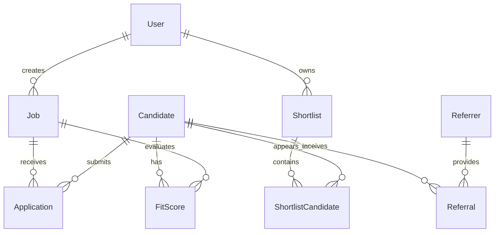

# Skylevel Database Schema

**Version**: 1.0  
**Date**: January 2025  
**Database**: PostgreSQL 15+  
**ORM**: Prisma 5.7+  
**Status**: Greenfield Rebuild Schema

---

## ⚠️ Important: Database Schema for Next.js Rebuild

**Current State**: React + Vite prototype with mock data (no database)  
**Target State**: PostgreSQL + Prisma in Next.js 14 rebuild

This schema will be implemented when the Next.js greenfield rebuild begins. The current prototype uses static mock data files.

---

## Schema Overview



---

## Complete Prisma Schema

```prisma
// prisma/schema.prisma

generator client {
  provider = "prisma-client-js"
}

datasource db {
  provider = "postgresql"
  url      = env("DATABASE_URL")
}

// ============================================
// USERS & AUTHENTICATION
// ============================================

model User {
  id            String    @id @default(uuid())
  clerkId       String    @unique // Clerk user ID
  email         String    @unique
  name          String
  role          UserRole  @default(RECRUITER)
  company       String?
  avatarUrl     String?
  createdAt     DateTime  @default(now())
  updatedAt     DateTime  @updatedAt
  
  // Relations
  jobs          Job[]
  shortlists    Shortlist[]
  activities    Activity[]
  
  @@index([clerkId])
  @@index([email])
  @@map("users")
}

enum UserRole {
  RECRUITER
  HIRING_MANAGER
  ADMIN
  CANDIDATE
}

// ============================================
// JOBS
// ============================================

model Job {
  id              String      @id @default(uuid())
  title           String
  company         String
  location        String
  description     String      @db.Text
  responsibilities String[]
  qualifications  String[]
  benefits        String[]
  requiredSkills  Json        // Array of {name, importance}
  preferredSkills Json?
  salaryMin       Int?
  salaryMax       Int?
  salaryCurrency  String      @default("USD")
  status          JobStatus   @default(OPEN)
  
  // JobPrint™ Calibration
  tmsWeight       Float       @default(0.5)
  srsWeight       Float       @default(0.3)
  rnsWeight       Float       @default(0.2)
  customWeights   Json?       // Advanced calibration
  
  // Metadata
  recruiterId     String
  createdAt       DateTime    @default(now())
  updatedAt       DateTime    @updatedAt
  closedAt        DateTime?
  
  // Relations
  recruiter       User        @relation(fields: [recruiterId], references: [id])
  applications    Application[]
  fitScores       FitScore[]
  shortlists      Shortlist[]
  
  @@index([recruiterId])
  @@index([status])
  @@index([createdAt])
  @@map("jobs")
}

enum JobStatus {
  DRAFT
  OPEN
  CLOSED
  ARCHIVED
}

// ============================================
// CANDIDATES
// ============================================

model Candidate {
  id          String        @id @default(uuid())
  email       String        @unique
  name        String
  phone       String?
  location    String
  role        String
  
  // Skills
  skills      Json          // Array of {name, proficiency}
  
  // External profiles
  resumeUrl   String?
  linkedinUrl String?
  githubUrl   String?
  portfolioUrl String?
  
  // Work samples
  workSamples Json?         // Array of {title, url, description}
  
  // Metadata
  source      String?       // 'direct', 'referral', 'ats_import'
  status      CandidateStatus @default(NEW)
  createdAt   DateTime      @default(now())
  updatedAt   DateTime      @updatedAt
  
  // Relations
  applications    Application[]
  fitScores       FitScore[]
  referrals       Referral[]
  shortlistEntries ShortlistCandidate[]
  
  @@index([email])
  @@index([status])
  @@index([createdAt])
  @@map("candidates")
}

enum CandidateStatus {
  NEW
  REVIEWING
  SHORTLISTED
  INTERVIEWING
  OFFERED
  HIRED
  REJECTED
  WITHDRAWN
}

// ============================================
// APPLICATIONS
// ============================================

model Application {
  id          String    @id @default(uuid())
  candidateId String
  jobId       String
  
  // Application data
  coverLetter String?   @db.Text
  answers     Json?     // Custom questions
  
  // Status tracking
  status      ApplicationStatus @default(SUBMITTED)
  viewedAt    DateTime?
  reviewedAt  DateTime?
  
  createdAt   DateTime  @default(now())
  updatedAt   DateTime  @updatedAt
  
  // Relations
  candidate   Candidate @relation(fields: [candidateId], references: [id], onDelete: Cascade)
  job         Job       @relation(fields: [jobId], references: [id], onDelete: Cascade)
  
  @@unique([candidateId, jobId]) // One application per candidate-job pair
  @@index([jobId])
  @@index([status])
  @@map("applications")
}

enum ApplicationStatus {
  SUBMITTED
  VIEWED
  UNDER_REVIEW
  SHORTLISTED
  REJECTED
}

// ============================================
// FIT SCORES
// ============================================

model FitScore {
  id          String    @id @default(uuid())
  candidateId String
  jobId       String
  
  // Score components
  overall     Float
  tms         Float     // Technical Match Score
  srs         Float     // Soft Skills Rating
  rns         Float     // Referral Network Score
  
  // Confidence & explanation
  confidence  ScoreConfidence
  explanation Json      // {tms: "...", srs: "...", rns: "..."}
  
  // Version tracking
  version     Int       @default(1)
  calculatedAt DateTime @default(now())
  
  // Relations
  candidate   Candidate @relation(fields: [candidateId], references: [id], onDelete: Cascade)
  job         Job       @relation(fields: [jobId], references: [id], onDelete: Cascade)
  
  @@unique([candidateId, jobId, version])
  @@index([overall])
  @@index([calculatedAt])
  @@map("fit_scores")
}

enum ScoreConfidence {
  HIGH      // 3+ referrals, all data complete
  MEDIUM    // 1-2 referrals, most data complete
  LOW       // No referrals, self-reported only
}

// ============================================
// REFERRALS
// ============================================

model Referral {
  id          String    @id @default(uuid())
  candidateId String
  referrerId  String?   // If referrer is registered user
  
  // Referrer info
  referrerName  String
  referrerEmail String?
  relationship  ReferralRelationship
  yearsWorked   Int
  
  // Validation data
  skillsValidated Json    // Array of {name, rating}
  feedback        String? @db.Text
  
  // Trust calculation
  trustScore      Int     // 0-100, calculated based on network
  
  // Access control
  token           String  @unique  // For public access
  submittedAt     DateTime @default(now())
  
  // Relations
  candidate       Candidate @relation(fields: [candidateId], references: [id], onDelete: Cascade)
  referrer        Referrer? @relation(fields: [referrerId], references: [id])
  
  @@index([candidateId])
  @@index([token])
  @@map("referrals")
}

enum ReferralRelationship {
  COLLEAGUE
  MANAGER
  DIRECT_REPORT
  CLIENT
  MENTOR
  OTHER
}

model Referrer {
  id          String    @id @default(uuid())
  name        String
  email       String    @unique
  linkedinUrl String?
  company     String?
  role        String?
  
  // Credibility scoring
  credibilityScore Int  @default(50) // 0-100
  referralCount    Int  @default(0)
  
  createdAt   DateTime  @default(now())
  
  // Relations
  referrals   Referral[]
  
  @@index([email])
  @@map("referrers")
}

// ============================================
// SHORTLISTS
// ============================================

model Shortlist {
  id          String    @id @default(uuid())
  name        String
  jobId       String
  recruiterId String
  
  // Sharing
  shareToken  String    @unique
  isPublic    Boolean   @default(false)
  
  createdAt   DateTime  @default(now())
  updatedAt   DateTime  @updatedAt
  
  // Relations
  job         Job       @relation(fields: [jobId], references: [id], onDelete: Cascade)
  recruiter   User      @relation(fields: [recruiterId], references: [id])
  candidates  ShortlistCandidate[]
  
  @@index([jobId])
  @@index([recruiterId])
  @@index([shareToken])
  @@map("shortlists")
}

model ShortlistCandidate {
  id          String    @id @default(uuid())
  shortlistId String
  candidateId String
  position    Int       @default(0) // For ordering
  notes       String?   @db.Text
  
  addedAt     DateTime  @default(now())
  
  // Relations
  shortlist   Shortlist @relation(fields: [shortlistId], references: [id], onDelete: Cascade)
  candidate   Candidate @relation(fields: [candidateId], references: [id], onDelete: Cascade)
  
  @@unique([shortlistId, candidateId])
  @@index([shortlistId])
  @@map("shortlist_candidates")
}

// ============================================
// BIAS AUDIT
// ============================================

model BiasAudit {
  id          String    @id @default(uuid())
  jobId       String
  
  // Metrics
  totalCandidates Int
  passThroughRate Float
  
  // Demographic breakdown (anonymized aggregates)
  genderDistribution    Json
  ethnicityDistribution Json
  
  // Disparity flags
  disparities Json      // Array of {category, variance, flagged}
  
  // Compliance
  complianceScore Int   // 0-100
  recommendation  String? @db.Text
  
  generatedAt DateTime  @default(now())
  
  @@index([jobId])
  @@index([generatedAt])
  @@map("bias_audits")
}

// ============================================
// ACTIVITY LOG
// ============================================

model Activity {
  id          String    @id @default(uuid())
  userId      String
  type        ActivityType
  entityType  String    // 'candidate', 'job', 'shortlist'
  entityId    String
  metadata    Json?
  
  createdAt   DateTime  @default(now())
  
  // Relations
  user        User      @relation(fields: [userId], references: [id])
  
  @@index([userId])
  @@index([createdAt])
  @@map("activities")
}

enum ActivityType {
  VIEWED
  CREATED
  UPDATED
  DELETED
  SHORTLISTED
  REVIEWED
  SCHEDULED
  HIRED
  REJECTED
}

// ============================================
// NOTIFICATIONS
// ============================================

model Notification {
  id        String    @id @default(uuid())
  userId    String
  type      NotificationType
  title     String
  message   String    @db.Text
  link      String?
  read      Boolean   @default(false)
  
  createdAt DateTime  @default(now())
  readAt    DateTime?
  
  @@index([userId])
  @@index([read])
  @@index([createdAt])
  @@map("notifications")
}

enum NotificationType {
  HOT_CANDIDATE      // 90+ score
  NEW_APPLICATION
  NEW_REFERRAL
  SCORE_UPDATED
  INTERVIEW_SCHEDULED
  BIAS_ALERT
}
```

---

## Indexes Strategy

### Performance-Critical Indexes

```sql
-- Candidates (most queried)
CREATE INDEX idx_candidates_email ON candidates(email);
CREATE INDEX idx_candidates_status ON candidates(status);
CREATE INDEX idx_candidates_created ON candidates(created_at DESC);

-- Fit Scores (sorting/filtering)
CREATE INDEX idx_fitscores_overall ON fit_scores(overall DESC);
CREATE INDEX idx_fitscores_candidate ON fit_scores(candidate_id);
CREATE INDEX idx_fitscores_job ON fit_scores(job_id);
CREATE INDEX idx_fitscores_confidence ON fit_scores(confidence);

-- Jobs (recruiter queries)
CREATE INDEX idx_jobs_recruiter ON jobs(recruiter_id);
CREATE INDEX idx_jobs_status ON jobs(status);
CREATE INDEX idx_jobs_created ON jobs(created_at DESC);

-- Applications (status tracking)
CREATE INDEX idx_applications_job ON applications(job_id);
CREATE INDEX idx_applications_status ON applications(status);
CREATE INDEX idx_applications_candidate_job ON applications(candidate_id, job_id);

-- Referrals (token lookup)
CREATE INDEX idx_referrals_token ON referrals(token);
CREATE INDEX idx_referrals_candidate ON referrals(candidate_id);
```

---

## Migrations

### Initial Migration

```bash
npx prisma migrate dev --name init
```

### Migration Files

```sql
-- migrations/20250108_init/migration.sql
-- Auto-generated by Prisma, review before applying

CREATE TYPE "UserRole" AS ENUM ('RECRUITER', 'HIRING_MANAGER', 'ADMIN', 'CANDIDATE');
CREATE TYPE "JobStatus" AS ENUM ('DRAFT', 'OPEN', 'CLOSED', 'ARCHIVED');
-- ... (continued)
```

---

## Seed Data

```typescript
// prisma/seed.ts
import { PrismaClient } from '@prisma/client';

const prisma = new PrismaClient();

async function main() {
  // Create test recruiter
  const recruiter = await prisma.user.create({
    data: {
      clerkId: 'clerk_test_recruiter',
      email: 'recruiter@skylevel.com',
      name: 'Test Recruiter',
      role: 'RECRUITER',
      company: 'Skylevel',
    },
  });

  // Create test job
  const job = await prisma.job.create({
    data: {
      title: 'Senior Frontend Developer',
      company: 'Skylevel',
      location: 'Remote',
      description: 'Building the future of hiring',
      requiredSkills: [
        { name: 'React', importance: 'required' },
        { name: 'TypeScript', importance: 'required' },
        { name: 'Next.js', importance: 'preferred' },
      ],
      status: 'OPEN',
      recruiterId: recruiter.id,
    },
  });

  // Create test candidates (50+)
  for (let i = 1; i <= 50; i++) {
    const candidate = await prisma.candidate.create({
      data: {
        email: `candidate${i}@example.com`,
        name: `Test Candidate ${i}`,
        location: 'San Francisco, CA',
        role: 'Frontend Developer',
        skills: [
          { name: 'React', proficiency: Math.floor(Math.random() * 5) + 6 },
          { name: 'TypeScript', proficiency: Math.floor(Math.random() * 5) + 5 },
        ],
        status: 'NEW',
      },
    });

    // Create application
    await prisma.application.create({
      data: {
        candidateId: candidate.id,
        jobId: job.id,
        status: 'SUBMITTED',
      },
    });

    // Create Fit Score
    const tms = Math.floor(Math.random() * 30) + 60; // 60-90
    const srs = Math.floor(Math.random() * 30) + 50; // 50-80
    const rns = Math.floor(Math.random() * 40) + 30; // 30-70
    const overall = Math.round(tms * 0.5 + srs * 0.3 + rns * 0.2);

    await prisma.fitScore.create({
      data: {
        candidateId: candidate.id,
        jobId: job.id,
        overall,
        tms,
        srs,
        rns,
        confidence: rns > 60 ? 'HIGH' : rns > 40 ? 'MEDIUM' : 'LOW',
        explanation: {
          tms: `${Math.floor((tms / 100) * 10)}/10 required skills matched`,
          srs: `Self-rated soft skills: ${srs}/100`,
          rns: `${Math.floor(rns / 20)} peer validations`,
        },
      },
    });
  }

  console.log('✅ Seed data created');
}

main()
  .catch((e) => {
    console.error(e);
    process.exit(1);
  })
  .finally(async () => {
    await prisma.$disconnect();
  });
```

Run seed:
```bash
npx prisma db seed
```

---

## Data Relationships

### One-to-Many
- User → Jobs (one recruiter has many jobs)
- Job → Applications (one job has many applications)
- Candidate → Referrals (one candidate receives many referrals)

### Many-to-Many
- Shortlist ↔ Candidates (via ShortlistCandidate junction table)

### One-to-One
- Application ↔ Candidate-Job pair (unique constraint)
- FitScore ↔ Candidate-Job pair (per version)

---

## Query Examples

### Get Candidates with Fit Scores for Job

```typescript
const candidates = await prisma.candidate.findMany({
  where: {
    applications: {
      some: { jobId: 'job-123' }
    }
  },
  include: {
    fitScores: {
      where: { jobId: 'job-123' },
      orderBy: { version: 'desc' },
      take: 1,
    },
    referrals: true,
  },
  orderBy: {
    fitScores: {
      _count: 'desc',
    },
  },
});
```

### Get Hot Candidates (90+ score)

```typescript
const hotCandidates = await prisma.candidate.findMany({
  where: {
    fitScores: {
      some: {
        overall: { gte: 90 },
        jobId: 'job-123',
      },
    },
  },
  include: {
    fitScores: {
      where: { jobId: 'job-123' },
      orderBy: { overall: 'desc' },
    },
    referrals: true,
  },
});
```

### Bias Audit Query

```typescript
const auditData = await prisma.$queryRaw`
  SELECT 
    COUNT(*) as total,
    AVG(CASE WHEN fs.overall >= 80 THEN 1 ELSE 0 END) as pass_rate,
    -- Anonymized aggregates only
  FROM candidates c
  JOIN fit_scores fs ON c.id = fs.candidate_id
  WHERE fs.job_id = ${jobId}
`;
```

---

## Backup & Disaster Recovery

### Automated Backups

```bash
# Daily backup script
pg_dump $DATABASE_URL > backup_$(date +%Y%m%d).sql

# Retention: 30 days
find ./backups -name "*.sql" -mtime +30 -delete
```

### Point-in-Time Recovery

```bash
# Restore from backup
psql $DATABASE_URL < backup_20250108.sql
```

---

**Status**: Approved  
**Next Step**: Run initial migration  
**Owner**: Backend Team
